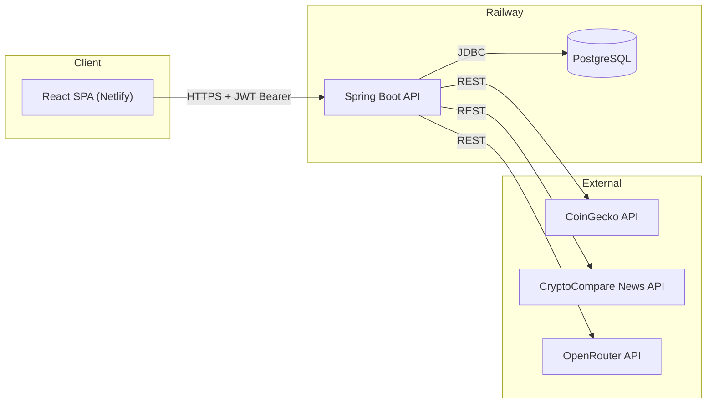
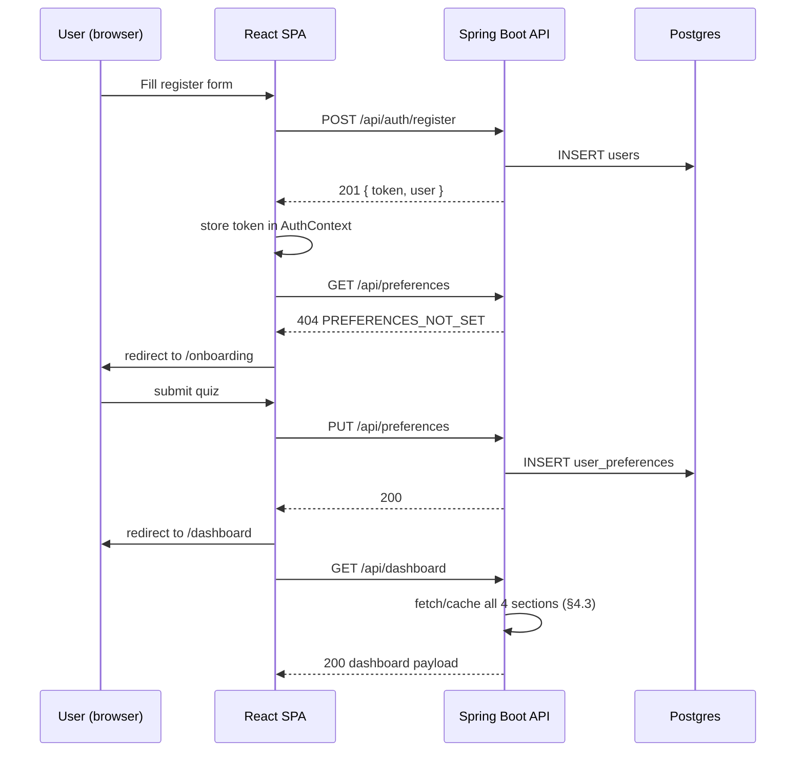
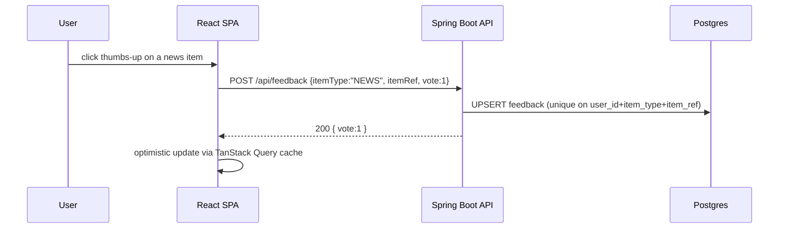

# AI Crypto Advisor — Technical Specification

Take-home assignment (Moveo — WEB track). This document is the single source of truth for scope, contracts, and schema. Where the original assignment left a choice open, the decision is stated explicitly below — nothing is left implicit.

Repo: https://github.com/DavidSalmon13/AI-Crypto-Advisor (monorepo)

---

## 1. Overview

A personalized crypto dashboard. A user registers, completes a one-time onboarding quiz (assets of interest, investor type, preferred content style), and lands on a **Daily Dashboard** with four sections: Coin Prices, Market News, AI Insight of the Day, and a Fun Crypto Meme. Every content item in News/AI Insight/Meme can be voted 👍/👎, and votes are persisted for a future recommendation model (not implemented in this assignment — see §7.4).

"Daily" content (AI Insight, Meme) is generated **once per user per calendar day (UTC)** and cached, not regenerated on every page load.

### 1.1 Tech stack (final)

| Layer | Choice |
|---|---|
| Frontend | React 18 + Vite 5 + TypeScript, Tailwind CSS, TanStack Query, React Router v6 |
| Backend | Java 21 + Spring Boot 3.3.x (Web, Security, Validation, Data JPA) |
| DB | PostgreSQL 16 (Railway-managed) |
| Migrations | Flyway |
| Auth | JWT (HS256), Spring Security |
| AI | OpenRouter (free-tier model) |
| Market data | CoinGecko public API |
| News | CryptoCompare News API (CoinDesk Data) free tier + static JSON fallback |
| Memes | Static curated JSON (no live scraping) |
| Backend host | Railway (root dir `/backend`) |
| Frontend host | Netlify (base dir `/frontend`) |
| CI/CD | Native Railway + Netlify "deploy on push to `main`" — no separate GitHub Actions pipeline |

### 1.2 Repo layout

```
AI-Crypto-Advisor/
├── backend/     (Spring Boot app, Maven, root for Railway)
├── frontend/    (React app, base dir for Netlify)
├── specs.md
└── AI_USAGE.md  (AI-collaboration log, filled in during implementation)
```

---

## 2. Features

1. **Register** — email + name + password → account created, JWT returned (auto-login on register).
2. **Login** — email + password → JWT returned.
3. **Onboarding** (forced on first login, editable later):
   - Crypto assets of interest — multi-select from a curated list of 30 coins.
   - Investor type — single-select: `HODLER` | `DAY_TRADER` | `NFT_COLLECTOR`.
   - Preferred content style — multi-select: `MARKET_NEWS` | `CHARTS` | `SOCIAL` | `FUN`.
4. **Daily Dashboard** — always renders all 4 sections (see §6 for why content-type preference does not hide sections):
   - Coin Prices for the user's selected coins (live, CoinGecko).
   - Market News (CryptoCompare, cached 20 min server-side, static fallback on failure).
   - AI Insight of the Day (OpenRouter, generated once/user/day, cached).
   - Fun Crypto Meme (static pool, one picked deterministically per user/day, cached).
5. **Voting** — thumbs up/down on individual News articles, the AI Insight, and the Meme. Re-voting updates the existing vote (no duplicate rows). Coin Prices is not voteable (it's raw data, not curated content).
6. **DB access for reviewers** — read-only Postgres credentials shared out of band (not in the repo).

### 2.1 Explicitly out of scope

To remove ambiguity about what this build does *not* include: password reset/forgot-password flow, email verification, refresh tokens (JWT simply expires after 24h and the user re-logs in), an admin panel, multi-language support, dark mode, pagination on news (fixed page size, see §4.4), rate limiting beyond the news cache, and actual retraining of a recommendation model (design only, per §7.4).

---

## 3. Architecture



- Frontend and backend are separate deployables on separate origins; all communication is stateless REST + JSON, auth via `Authorization: Bearer <jwt>` header (no cookies, so no CORS-credentials complexity).
- Backend is the only caller of external APIs — API keys never reach the browser.
- Backend layering: `controller → service → repository`, plus `client` package for outbound HTTP integrations, `security` for JWT/auth, `dto` for request/response shapes (entities never serialized directly).

### 3.1 Backend package structure

```
com.moveo.aicryptoadvisor
├── AiCryptoAdvisorApplication.java
├── config/            (SecurityConfig, CorsConfig, RestClientConfig, CacheConfig)
├── security/           (JwtService, JwtAuthFilter, UserDetailsServiceImpl)
├── controller/          (AuthController, PreferencesController, DashboardController, FeedbackController)
├── service/             (AuthService, PreferenceService, DashboardService, AiInsightService, MemeService, NewsService, CoinPriceService, FeedbackService)
├── client/              (CoinGeckoClient, CryptoCompareClient, OpenRouterClient)
├── repository/          (UserRepository, UserPreferencesRepository, DailyContentRepository, FeedbackRepository)
├── entity/              (User, UserPreferences, DailyContent, Feedback)
├── dto/                 (request/ and response/ subpackages)
└── exception/            (GlobalExceptionHandler, ApiException + subtypes)
```

### 3.2 Frontend structure

```
frontend/src/
├── api/                 (authApi.ts, preferencesApi.ts, dashboardApi.ts, feedbackApi.ts — thin wrappers over apiClient)
├── lib/
│   ├── apiClient.ts     (axios instance, base URL from VITE_API_BASE_URL, JWT request interceptor, 401 → logout redirect)
│   └── queryClient.ts   (TanStack QueryClient instance)
├── features/
│   ├── auth/            (LoginPage.tsx, RegisterPage.tsx, AuthContext.tsx, useAuth.ts)
│   ├── onboarding/       (OnboardingPage.tsx, steps/AssetsStep.tsx, steps/InvestorTypeStep.tsx, steps/ContentStep.tsx)
│   └── dashboard/        (DashboardPage.tsx, CoinPricesSection.tsx, MarketNewsSection.tsx, AiInsightSection.tsx, MemeSection.tsx, VoteButtons.tsx)
├── components/           (Button.tsx, Card.tsx, Spinner.tsx, ProtectedRoute.tsx)
├── types/                (auth.ts, preferences.ts, dashboard.ts — mirror backend DTOs field-for-field)
├── routes/AppRouter.tsx
├── App.tsx / main.tsx
```

**Routing/guard rules (exact):**
- `/login`, `/register` — public. If already authenticated, redirect to `/dashboard`.
- Any other route — requires a valid JWT in memory (`AuthContext`), else redirect to `/login`.
- After successful auth, frontend calls `GET /api/preferences`. `404` → force redirect to `/onboarding` regardless of the originally requested route. `200` → allow `/dashboard`.
- `/onboarding` remains reachable after completion (to edit answers); submitting always does a full `PUT` (replace, not patch).

---

## 4. Backend Design — API Contract

Base path: `/api`. All request/response bodies are JSON. All authenticated endpoints require `Authorization: Bearer <jwt>`; missing/invalid/expired token → `401` with the standard error envelope (§4.5).

### 4.1 Auth

**`POST /api/auth/register`**
Request:
```json
{ "email": "user@example.com", "name": "Jane Doe", "password": "Str0ngPass" }
```
Validation: `email` — valid email format, unique (else `409 EMAIL_TAKEN`). `name` — 1–100 chars. `password` — 8–72 chars, at least one letter and one digit.
Response `201`:
```json
{ "token": "<jwt>", "user": { "id": "uuid", "email": "user@example.com", "name": "Jane Doe" } }
```

**`POST /api/auth/login`**
Request: `{ "email": "...", "password": "..." }`
Response `200`: same shape as register response. Wrong credentials → `401 INVALID_CREDENTIALS` (do not reveal whether email exists).

**JWT contents:** header `HS256`; claims `sub` (user id, UUID string), `email`, `iat`, `exp` (`iat` + 24h). Secret from env `JWT_SECRET` (min 32 bytes). No refresh token — client re-authenticates on expiry (frontend `apiClient` catches `401`, clears context, redirects to `/login`).

### 4.2 Preferences

**`GET /api/preferences/options`** — public, no auth required (used to render the onboarding form).
Response `200`:
```json
{
  "coins": [ { "id": "bitcoin", "symbol": "BTC", "name": "Bitcoin" }, ... 30 total ],
  "investorTypes": ["HODLER", "DAY_TRADER", "NFT_COLLECTOR"],
  "contentTypes": ["MARKET_NEWS", "CHARTS", "SOCIAL", "FUN"]
}
```
The curated coin list (fixed, `backend/src/main/resources/data/coins.json`, 30 entries) — CoinGecko ids used verbatim in API calls:
`bitcoin, ethereum, ripple, cardano, solana, dogecoin, polkadot, chainlink, litecoin, avalanche-2, matic-network, tron, cosmos, uniswap, stellar, monero, algorand, vechain, filecoin, aave, the-graph, near, aptos, arbitrum, optimism, sui, fantom, internet-computer, shiba-inu, binancecoin`.

**`GET /api/preferences`** (auth) — returns the caller's saved preferences, or `404 PREFERENCES_NOT_SET` if onboarding hasn't been completed (this 404 is what the frontend uses as the onboarding gate).
Response `200`:
```json
{ "investorType": "HODLER", "interests": ["bitcoin","ethereum"], "contentTypes": ["MARKET_NEWS","FUN"] }
```

**`PUT /api/preferences`** (auth) — full upsert (create on first submit, replace on edit).
Request: same shape as the `200` response above.
Validation: `investorType` ∈ enum; `contentTypes` — 1–4 items, each ∈ enum, no duplicates; `interests` — 1–10 items, each must exist in the curated coin list (else `400 UNKNOWN_COIN_ID`).
Response `200`: the saved object.

### 4.3 Dashboard

**`GET /api/dashboard`** (auth) — single aggregating endpoint; orchestrates all 4 sections server-side.
Response `200`:
```json
{
  "date": "2026-08-14",
  "coinPrices": [
    { "id": "bitcoin", "symbol": "BTC", "name": "Bitcoin", "priceUsd": 61234.12, "change24hPct": 2.34 }
  ],
  "marketNews": [
    { "id": "cc-4821931", "title": "...", "url": "https://...", "source": "CoinDesk", "publishedAt": "2026-08-14T06:00:00Z", "userVote": null }
  ],
  "aiInsight": { "id": "uuid", "text": "...", "generatedAt": "2026-08-14T00:03:11Z", "fallback": false, "userVote": 1 },
  "meme": { "id": "uuid", "imageUrl": "https://...", "caption": "...", "userVote": null }
}
```
`aiInsight.id` and `meme.id` are both the `daily_content.id` UUID, not the id of the underlying pool entry — that is what makes them usable as `itemRef` (§4.4) and joinable back to the generated payload for §7.4. The meme pool's own id (`meme-014`) is carried inside `daily_content.payload.memeId` and is not exposed on the wire.
`userVote` is `1`, `-1`, or `null` (no vote yet) — resolved server-side by joining `feedback` for the current user, so the frontend never has to reconcile vote state itself.

Orchestration logic per section (exact, no ambiguity):
- **Coin Prices**: always live — calls CoinGecko `/simple/price?ids=<comma-joined interests>&vs_currencies=usd&include_24hr_change=true` on every request. No DB caching (price staleness is undesirable here). If the user has 0 interests saved (shouldn't happen given §4.2 validation), the array is empty.
- **Market News**: server-wide (not per-user) in-memory cache, TTL 20 minutes, keyed by the sorted set of coin ids currently requested across active users — simplified to: one shared cache entry for "general crypto news," TTL 20 min, refreshed lazily on the first request after expiry. Source: CryptoCompare News API — `GET https://min-api.cryptocompare.com/data/v2/news/?lang=EN`, authenticated via `Authorization: Apikey ${CRYPTOCOMPARE_API_KEY}` header. Field mapping from each article in the response's `Data` array: `id` → `"cc-" + id`, `title` → `title`, `url` → `url`, `source_info.name` → `source`, `published_on` (unix seconds) → `publishedAt` (ISO-8601 UTC). On CryptoCompare error/timeout (5s timeout), serve `backend/src/main/resources/data/news-fallback.json` (10 static headlines) and continue — never fail the whole dashboard call.
- **AI Insight**: check `daily_content` for `(user_id, content_type='AI_INSIGHT', content_date=today UTC)`. Hit → return cached payload. Miss → call OpenRouter (see §7.1 for prompt), persist to `daily_content`, return. If OpenRouter call fails (timeout 10s, non-2xx, or malformed response), persist and return a static fallback insight with `"fallback": true` — never a 5xx to the client for this reason.
- **Meme**: check `daily_content` for `(user_id, content_type='MEME', content_date=today UTC)`. Hit → return cached payload. Miss → deterministically pick `hash(userId + date) mod memes.length` from the static 25-entry `memes.json`, persist, return. Deterministic picking (not random) means retries within the same day are idempotent even before the cache write lands.

### 4.4 Feedback

**`POST /api/feedback`** (auth) — upsert a vote.
Request:
```json
{ "itemType": "NEWS", "itemRef": "cc-4821931", "vote": 1 }
```
`itemType` ∈ `NEWS | AI_INSIGHT | MEME`. `itemRef` — for `NEWS` it's the `cc-`-prefixed CryptoCompare article id (as returned in `marketNews[].id`); for `AI_INSIGHT`/`MEME` it's the `daily_content.id` UUID (as returned in `aiInsight.id`/`meme.id`). `vote` ∈ `{1, -1}`.
Server sets `item_date` = today (UTC) automatically; does not trust a client-supplied date.
Response `200`: `{ "id": "uuid", "itemType": "NEWS", "itemRef": "cc-4821931", "vote": 1 }`. Upsert is keyed on the unique constraint `(user_id, item_type, item_ref)` — a second call with a different `vote` value flips the existing row rather than creating a new one.

**`DELETE /api/feedback/{itemType}/{itemRef}`** (auth) — retract a vote. `204` on success (idempotent — `204` even if no vote existed).

News list size (fixed, not paginated): dashboard always returns the **top 10** articles from the CryptoCompare response (the API returns articles sorted latest-first; take the first 10).

### 4.5 Error envelope (all non-2xx responses)

```json
{ "error": "UNKNOWN_COIN_ID", "message": "Coin id 'dogecion' is not in the supported list.", "fieldErrors": {} }
```
`fieldErrors` is populated (`{"field": "reason"}`) only for `400` bean-validation failures; otherwise `{}`. Handled centrally by `GlobalExceptionHandler` (`@ControllerAdvice`). Standard mappings: validation → `400`, bad/missing JWT → `401`, authenticated-but-forbidden → `403` (not used in this MVP — single-role app), not found → `404`, uniqueness conflicts (e.g. duplicate email) → `409`, everything unexpected → `500` with `error: "INTERNAL_ERROR"` and no stack trace leaked.

### 4.6 Health check

`GET /actuator/health` — Spring Boot Actuator, exposed unauthenticated, used as the Railway healthcheck path.

---

## 5. Database

PostgreSQL, all tables use `UUID` primary keys (`gen_random_uuid()`, via the `pgcrypto` extension enabled in the first migration) to avoid exposing sequential/enumerable ids in API responses and JWTs. Flyway migration files live in `backend/src/main/resources/db/migration/`.

### 5.1 Schema (V1__init.sql)

```sql
CREATE EXTENSION IF NOT EXISTS pgcrypto;

CREATE TABLE users (
    id            UUID PRIMARY KEY DEFAULT gen_random_uuid(),
    email         VARCHAR(255) NOT NULL UNIQUE,
    name          VARCHAR(100) NOT NULL,
    password_hash VARCHAR(255) NOT NULL,
    created_at    TIMESTAMPTZ NOT NULL DEFAULT now(),
    updated_at    TIMESTAMPTZ NOT NULL DEFAULT now()
);

CREATE TABLE user_preferences (
    id             UUID PRIMARY KEY DEFAULT gen_random_uuid(),
    user_id        UUID NOT NULL UNIQUE REFERENCES users(id) ON DELETE CASCADE,
    investor_type  VARCHAR(20) NOT NULL CHECK (investor_type IN ('HODLER','DAY_TRADER','NFT_COLLECTOR')),
    interests      JSONB NOT NULL,      -- e.g. ["bitcoin","ethereum"]
    content_types  JSONB NOT NULL,      -- e.g. ["MARKET_NEWS","FUN"]
    created_at     TIMESTAMPTZ NOT NULL DEFAULT now(),
    updated_at     TIMESTAMPTZ NOT NULL DEFAULT now()
);

CREATE TABLE daily_content (
    id            UUID PRIMARY KEY DEFAULT gen_random_uuid(),
    user_id       UUID NOT NULL REFERENCES users(id) ON DELETE CASCADE,
    content_type  VARCHAR(20) NOT NULL CHECK (content_type IN ('AI_INSIGHT','MEME')),
    content_date  DATE NOT NULL,
    payload       JSONB NOT NULL,
    created_at    TIMESTAMPTZ NOT NULL DEFAULT now(),
    UNIQUE (user_id, content_type, content_date)
);

CREATE TABLE feedback (
    id          UUID PRIMARY KEY DEFAULT gen_random_uuid(),
    user_id     UUID NOT NULL REFERENCES users(id) ON DELETE CASCADE,
    item_type   VARCHAR(20) NOT NULL CHECK (item_type IN ('NEWS','AI_INSIGHT','MEME')),
    item_ref    VARCHAR(255) NOT NULL,
    vote        SMALLINT NOT NULL CHECK (vote IN (-1, 1)),
    item_date   DATE NOT NULL,
    created_at  TIMESTAMPTZ NOT NULL DEFAULT now(),
    updated_at  TIMESTAMPTZ NOT NULL DEFAULT now(),
    UNIQUE (user_id, item_type, item_ref)
);

CREATE INDEX idx_daily_content_lookup ON daily_content (user_id, content_type, content_date);
CREATE INDEX idx_feedback_user ON feedback (user_id);
```

`payload` shapes: `AI_INSIGHT` → `{"text": "...", "fallback": false}`; `MEME` → `{"memeId": "meme-014", "imageUrl": "...", "caption": "..."}`.

Migrations run automatically on backend boot (`spring.flyway.enabled=true`, default Spring Boot behavior) — no manual migration step in deployment.

### 5.2 Static resource data (not DB tables)

- `data/coins.json` — the 30-coin curated onboarding list (§4.2).
- `data/memes.json` — 25 `{id, imageUrl, caption}` meme entries.
- `data/news-fallback.json` — 10 static `{id, title, url, source, publishedAt}` headlines, CryptoCompare-outage fallback.

These are read-only reference data seeded at application startup into in-memory beans (not persisted to Postgres) — they change only via a code deploy, never via runtime writes, so a DB table would add write-path complexity for no benefit.

---

## 6. Resolving the onboarding/dashboard ambiguity

The assignment's onboarding question ("What kind of content would you like to see? e.g. Market News, Charts, Social, Fun") does not map 1:1 onto the fixed 4 dashboard sections ("Market News, Coin Prices, AI Insight, Fun Crypto Meme"). **Decision: all 4 dashboard sections are always rendered for every user, unconditionally.** `content_types` is persisted and surfaced in the AI Insight prompt (§7.1) to bias tone/framing, and is stored for the bonus feedback-driven-model write-up (§7.4) — it does not toggle section visibility. This avoids an arbitrary mapping table and avoids a user being able to configure themselves into an empty dashboard.

---

## 7. AI Usage

### 7.1 AI Insight of the Day — generation

Triggered lazily on cache miss (§4.3). Model: `OPENROUTER_MODEL` env var, default `meta-llama/llama-3.1-8b-instruct:free`. Endpoint: `POST https://openrouter.ai/api/v1/chat/completions`, `Authorization: Bearer ${OPENROUTER_API_KEY}`, timeout 10s, `max_tokens` 220.

Prompt (constructed server-side, not user-editable):
```
System: You are a crypto market assistant. Write one short, informative daily insight
(3-5 sentences) for a retail crypto user. Be concrete and non-generic. Always end with
the exact sentence: "This is not financial advice." Do not use markdown formatting.

User: Investor profile — type: {investorType}, prefers: {contentTypes joined by ", "}.
Coins they follow: {interests joined by ", "}.
Today's 24h price change for their coins: {coin: pct, ...}.
Write today's insight for this user.
```
The 24h price change block is populated from the same CoinGecko call used for §4.3 Coin Prices (fetched once, reused for both), so the insight can reference real numbers instead of being generic.

On failure (timeout / non-2xx / empty completion): fallback text — `"Markets move fast — check today's prices and headlines above to form your own view. This is not financial advice."` — persisted with `fallback: true` so it's identifiable later and won't be silently regenerated as if it were a real model response on the same day.

### 7.2 Why lazy per-user caching, not a scheduled batch job

No `@Scheduled` cron job. Generation happens inside the request path of the *first* `GET /api/dashboard` call by a given user on a given UTC day, gated by the `daily_content` unique constraint (`ON CONFLICT DO NOTHING` semantics via a try-insert-then-read pattern in `AiInsightService`/`MemeService`). This keeps free-tier API usage proportional to actual active users rather than all-registered-users, and requires no scheduler infrastructure on Railway.

### 7.3 Meme selection

Not AI-generated — a static, hand-curated pool (§5.2), selected via `hash(userId + contentDate) mod 25`, cached like the AI Insight. Reddit scraping was considered and rejected (§ decision log — fragile, rate-limited, unnecessary risk for a graded demo).

### 7.4 Bonus — using feedback for future model improvement (design only, not implemented)

Every vote in `feedback` is a labeled example: `(user_id, item_type, item_ref, vote, item_date)`, joinable back to the user's `user_preferences` and, for `AI_INSIGHT`/`MEME`, to the exact generated `payload` via `daily_content`. That join produces a training row of the shape `(investorType, interests, contentTypes, generatedText/memeId, label ∈ {like, dislike})`.

Proposed offline pipeline (not built here):
1. **Batch export** — a periodic job (outside the app, e.g. a notebook or a small script run manually) joins `feedback ⋈ daily_content ⋈ user_preferences` into a flat dataset.
2. **Two applications of the data**:
   - *Meme/News ranking*: treat it as implicit feedback for a simple content-based filter — score each `(item, user-segment)` pair and prefer higher-scoring memes/articles for similar user segments (by `investorType`/`interests` overlap) going forward. No LLM needed — a logistic-regression-style or even a rolling like-ratio-per-item-per-segment score would work.
   - *AI Insight prompt tuning*: use liked vs. disliked insight text as few-shot examples appended to the system prompt (retrieval-augmented prompting), or as a fine-tuning/preference dataset (DPO-style) if moving off a free-tier hosted model later.
3. **Feedback loop cadence**: recompute segment scores / refresh few-shot examples on a schedule (e.g. weekly), not per-request — keeps it cheap and keeps the "insight" from oscillating based on a single new vote.
4. **Cold start**: new users with no votes yet fall back to the current non-personalized prompt (§7.1) until they've voted enough times (e.g. 5+ votes) to have a segment signal.

---

## 8. Data Flow

### 8.1 Registration → Onboarding → Dashboard



### 8.2 Voting



---

## 9. Deployment Plan

### 9.1 Backend — Railway

- Root directory: `/backend`. Build: Railway's native Java/Maven Nixpacks buildpack (`mvn -DskipTests package`, runs `java -jar target/*.jar`).
- Attach a Railway PostgreSQL plugin to the project; Railway injects `DATABASE_URL` automatically — backend's `application.yml` reads it via `${DATABASE_URL}` (Spring's standard `jdbc:` URL parsing; if Railway's format needs adapting, a small `DataSourceConfig` parses it into `spring.datasource.url/username/password`).
- Environment variables (set in Railway dashboard, never committed):

| Variable | Purpose |
|---|---|
| `DATABASE_URL` | Injected by Railway Postgres plugin |
| `JWT_SECRET` | ≥32-byte random string for HS256 signing |
| `OPENROUTER_API_KEY` | OpenRouter free-tier key |
| `OPENROUTER_MODEL` | default `meta-llama/llama-3.1-8b-instruct:free` |
| `CRYPTOCOMPARE_API_KEY` | CryptoCompare (CoinDesk Data) free-tier key |
| `FRONTEND_ORIGIN` | exact Netlify URL, for CORS allow-list |
| `PORT` | injected by Railway; Spring Boot binds to it automatically |

- Healthcheck path: `/actuator/health`.
- Deploy trigger: push to `main` (Railway GitHub integration, root dir filter on `/backend`).

### 9.2 Frontend — Netlify

- Base directory: `frontend`. Build command: `npm run build`. Publish directory: `frontend/dist`.
- `netlify.toml` includes an SPA redirect rule: `/* → /index.html 200` (client-side routing).
- Environment variable: `VITE_API_BASE_URL` = the deployed Railway backend URL (e.g. `https://ai-crypto-advisor-backend.up.railway.app`).
- Deploy trigger: push to `main` (Netlify GitHub integration, base-dir filter on `/frontend`).

### 9.3 DB access deliverable

A **read-only** Postgres role (`CREATE ROLE reviewer WITH LOGIN PASSWORD '...' NOSUPERUSER NOCREATEDB NOCREATEROLE; GRANT CONNECT ON DATABASE railway TO reviewer; GRANT USAGE ON SCHEMA public TO reviewer; GRANT SELECT ON ALL TABLES IN SCHEMA public TO reviewer;`) is created against the Railway Postgres instance, and its connection string is shared with the reviewer out of band (not committed to the repo) — satisfies the assignment's "Access to DB" deliverable without building an admin UI.

### 9.4 Deliverables checklist

- [ ] Public GitHub repo (this one) with `specs.md` + `AI_USAGE.md`.
- [ ] Deployed frontend URL (Netlify) + deployed backend URL (Railway).
- [ ] Read-only DB connection string shared with the reviewer.
- [ ] `AI_USAGE.md` populated with a summary of AI-tool collaboration during implementation.
